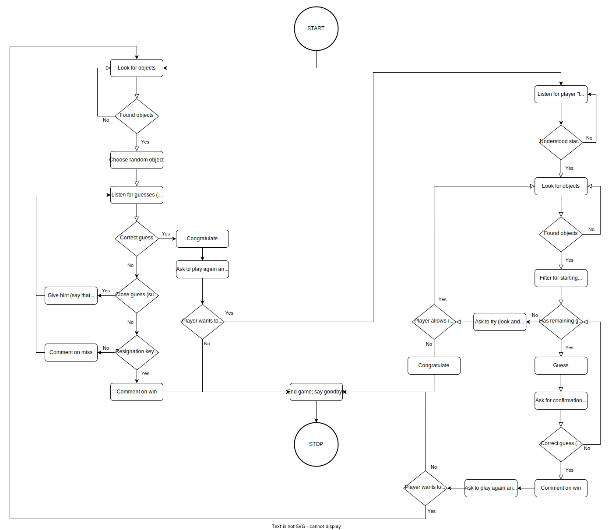

# ROBO Pepper I spy

This repository contains the code for the game "I spy" running on Pepper, a humanoid robot provided to us in the module ROBO at HSLU. \
Note that this repo does not contain all the code required to run the project (namely proxies for NaoQI), nor does it contain documentation and instructions for using the library and setting up the environment. These will all be made available to you by F.H. when you start with the project.

Parts of the code are copyrighted by F.H. and for that reason I will not provide a license, meaning this code is simply provided to you as means of inspiration for educational purposes. Do not try to cheat by submitting this code, you will get caught.

There's also certainly a bunch of improvements that could be made like better naming, more configurability, reuse of scans between games to decrease wait time, etc. However, it works just fine despite the rather obvious struggles with the NaoQI library and Python itself during development.

## Flow/State diagram

## General architecture of the whole I spy system

ispy.py runs on some machine with NaoQI, Python 2.7 and all the other required dependencies setup. It connects wirelessly via NaoQI to Pepper where Inputs and Outputs are handled (no code actually runs on Pepper). ispy.py also connects to the [ROBO AI backend](https://github.com/Joelius300/robo_hslu_ai-backend/tree/main) running on some machine (can be the same) on Python 3.10 through http. This AI backend is a proxy to Azure's Computer Vision services and enables object detection in images.
